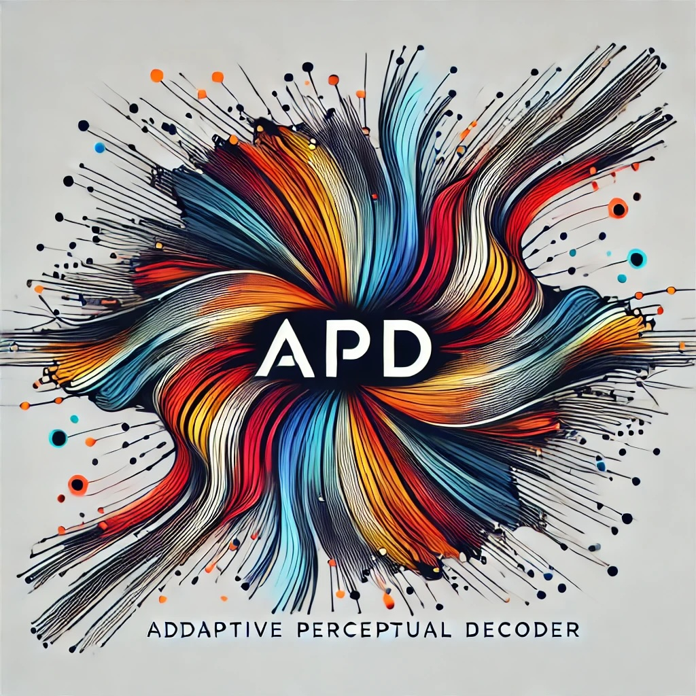

# APD: Adaptive Perceptual Decoder



[](https://www.python.org/downloads/)
[](https://github.com/chenxingqiang/APD/LICENSE)
[](https://github.com/chenxingqiang/APD)

## Adaptive Multi-scale Perception and Dynamic Feature Fusion for Text Recognition with Decoder-Centric Architecture

This project introduces the Adaptive Perceptual Decoder (APD), a novel OCR model that employs a decoder-centric architecture combined with multi-scale perception and dynamic feature fusion mechanisms. APD is designed to enhance text recognition performance in complex scenes, particularly for small fonts and irregularly shaped text.

### Key Features:

- **Multi-scale Perception**: Captures textual features at different scales for improved recognition of varying text sizes.
- **Dynamic Feature Fusion**: Adaptively weights features based on their relevance to the task.
- **Decoder-Centric Architecture**: Emphasizes the role of the decoder in processing and recognizing text.

The table below outlines the principal distinctions between the implementation described in the original paper and the current implementation.

|                                                             | Original implementation      | Current implementation |
|-------------------------------------------------------------| ---------------------------- |------------------------|
| Maximum token length <br/> (including image patch tokens)   | 512                          | 256                    |
| Supported language(s)                                       | English & Chinese            | English                |
| Pre-training corpus (planned)                               | Scene, printed & handwritten | Printed & handwritten  |
| Multi-scale perception                                      | Implemented                  | Implemented            |
| Dynamic feature fusion                                      | Implemented                  | Implemented            |

## Installation

```shell
git clone https://github.com/chenxingqiang/APD
cd APD
pip install -r requirements.txt
```

## Usage

```python
from apd.config import APDConfig
from apd.model import APDLMHeadModel
from apd.processor import APDProcessor
from PIL import Image

config = APDConfig()
model = APDLMHeadModel(config)
processor = APDProcessor(APDConfig())

model.eval()  # set model to evaluation mode for deterministic behaviour

path_to_image = ""  # path to image file
inputs = processor(
    images=Image.open(path_to_image).convert('RGB'),
    texts=processor.tokeniser.bos_token,
    return_tensors="pt"
)

model_output = model.generate(
    inputs=inputs,
    processor=processor,
    num_beams=3,
    use_cache=True
)

predicted_text = processor.tokeniser.decode(model_output[0], skip_special_tokens=True)
```

## Model Architecture

The APD model consists of the following key components:

1. **Multi-scale Feature Extractor**: Extracts features at different scales to capture both fine-grained details and high-level context.
2. **Dynamic Feature Fusion Module**: Uses attention mechanisms to adaptively combine multi-scale features.
3. **Transformer Decoder**: Processes the fused features to generate the recognized text.

## Performance

Our ablation studies demonstrate that the APD model significantly outperforms baseline models, especially in challenging scenarios involving small or irregularly shaped text. The combination of multi-scale perception and dynamic feature fusion contributes to improved accuracy and robustness across various text recognition tasks.

## Future Work

We are continuously working on improving the APD model. Future directions include:

- Extending support for multiple languages
- Scaling the model to handle larger and more diverse datasets
- Optimizing computational efficiency for real-time applications

## Acknowledgments

This project builds upon the original work presented in [APD: Decoder-only Transformer for Optical Character Recognition](https://doi.org/10.48550/arXiv.2308.15996), authored by Masato Fujitake. We extend our gratitude for their significant contributions to the field.

Additionally, we leverage the GPT-2 and Vision Transformer (ViT) models developed by Hugging Face, which have been instrumental in advancing our project's capabilities. Our sincere thanks go to the Hugging Face team for making such powerful tools accessible to the broader research community.

## Citation

If you use this work in your research, please cite:

```bibtex
@article{APD2023,
  title={Adaptive Multi-scale Perception and Dynamic Feature Fusion for Text Recognition with Decoder-Centric Architecture},
  author={Chen,Xingqiang},
  journal={arXiv preprint arXiv:XXXX.XXXXX},
  year={2023}
}
```

## License

This project is licensed under the [MIT License](LICENSE).