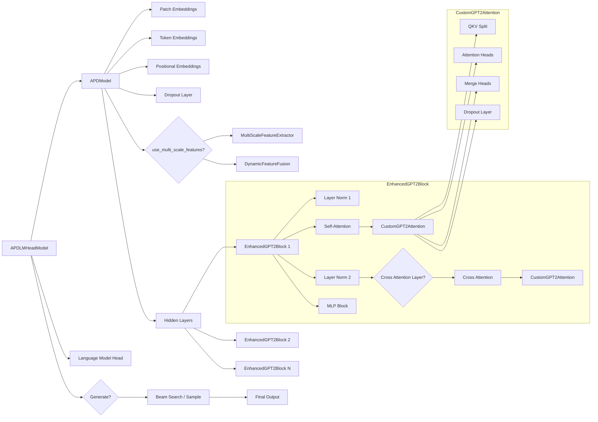
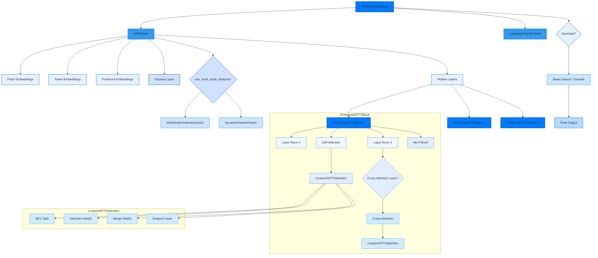

# APD models archtecture

1. **APDLMHeadModel**: 顶层模型，包含语言模型头和生成模块。
2. **APDModel**: 底层 Transformer 模型，整合了多尺度特征提取、动态特征融合、GPT2Block 等模块。
3. **CustomGPT2Attention**: 自定义注意力模块，包括自注意力和交叉注意力。
4. **EnhancedGPT2Block**: 增强的 GPT2 Block，包含注意力模块和 MLP。

## Simples Mermaid 架构图

### 说明

1. **APDLMHeadModel**: 这个是顶层模块，负责调用APDModel进行特征提取，最终通过**Language Model Head**生成输出。

2. **APDModel**: 该模块是核心部分，包含了：
   - **Patch Embeddings**：负责从图像中提取补丁嵌入。
   - **Token Embeddings**：处理输入文本的嵌入。
   - **Positional Embeddings**：用于处理输入序列中的位置信息。
   - **MultiScaleFeatureExtractor**（可选）：用于从不同尺度的图像中提取多尺度特征。
   - **DynamicFeatureFusion**（可选）：将多尺度特征融合成统一表示。

3. **Hidden Layers**: 使用了多个**EnhancedGPT2Block**，每个Block包含了LayerNorm、注意力模块（包括交叉注意力）和MLP模块。

4. **CustomGPT2Attention**: 用于计算查询、键、值的注意力机制，支持自注意力和交叉注意力。

5. **生成部分**: 在生成文本时，可以选择**Beam Search**或**Sampling**策略。

## Mermaid 架构图（美化版）

### 颜色说明

- **深蓝色**：用于表示主要模块（如 `APDLMHeadModel`, `APDModel`），突显模型的主要架构。
- **浅蓝色**：表示中间层的处理逻辑（如 `Token Embeddings`, `Patch Embeddings`），强调步骤的衔接和数据处理。
- **极浅蓝色**：用于更细粒度的操作，如层归一化、注意力计算等，保证层次感。

### 美化效果

1. **渐变蓝色**：从深到浅，表达主要模块到细节部分的递进关系，视觉上更有层次感。
2. **扁平化设计**：通过去除复杂的边框样式，使得架构图整体看起来更现代化。
3. **模块区分明显**：不同颜色的层级分明，让每个模块的功能一目了然，便于理解。
