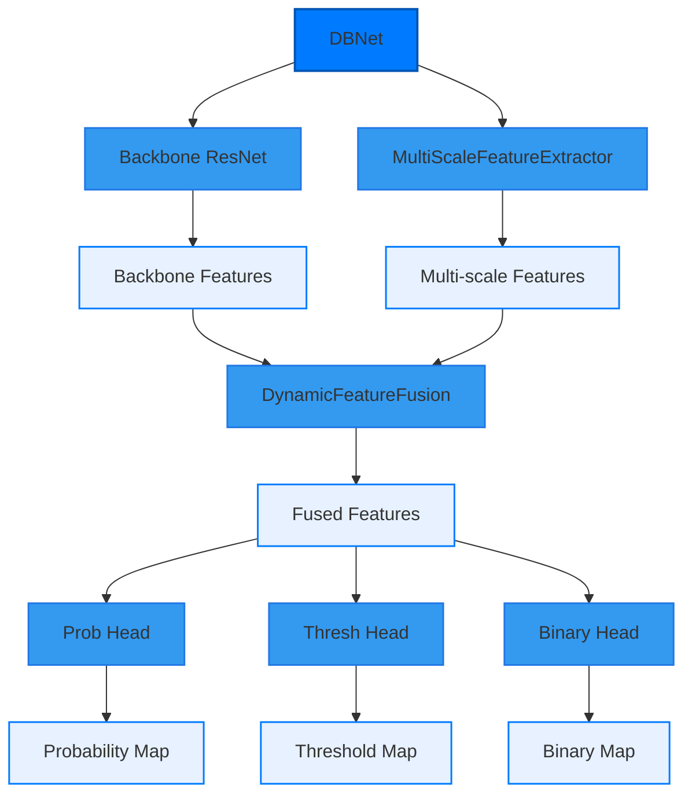

# APD Models Architecture

## 1. Text Detection Models

### 1.1 DBNet Architecture

#### Components Description

1. **DBNet**: 核心检测模型，整合了以下组件：
   - **Backbone (ResNet)**: 使用预训练的ResNet提取基础特征
   - **MultiScaleFeatureExtractor**: 多尺度特征提取器
   - **DynamicFeatureFusion**: 动态特征融合模块
   - **Detection Heads**: 包含三个检测头（概率图、阈值图、二值图）

2. **MultiScaleFeatureExtractor**:
   - 通过多个卷积层逐步降采样
   - 特征通道数逐步增加：[64, 128, 256, 512]
   - 每个block包含：Conv2d + BatchNorm + ReLU

3. **DynamicFeatureFusion**:
   - 对不同尺度特征进行通道对齐
   - 特征图尺寸统一化
   - 特征拼接和融合

4. **Detection Heads**:
   - **Probability Head**: 生成文本区域概率图
   - **Threshold Head**: 生成自适应阈值图
   - **Binary Head**: 生成二值化预测图

### 颜色说明

- **深蓝色**：用于表示主要模块（如 `DBNet`），突显模型的主要架构。
- **浅蓝色**：表示中间层的处理逻辑（如 `Backbone`, `MultiScaleFeatureExtractor`），强调步骤的衔接和数据处理。
- **极浅蓝色**：用于表示输出和特征（如 `Probability Map`, `Threshold Map`），保证层次感。
